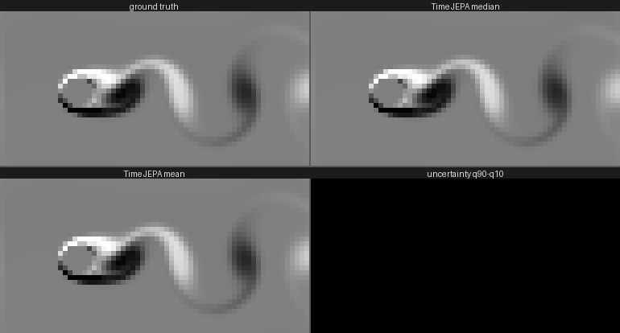
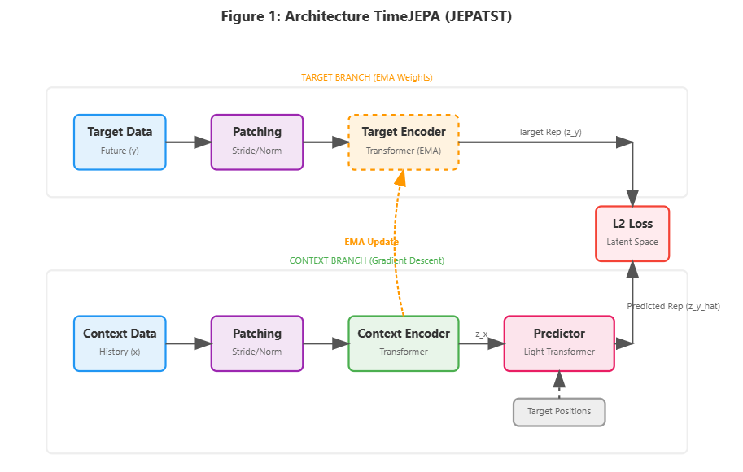

# TimeJEPA: What 1.1M Parameters and Joint Embeddings Can Do

A 1.14M-parameter univariate time series foundation model built around a Joint
Embedding Predictive Architecture (JEPA), evaluated zero-shot on all 97
GIFT-Eval configurations with **one checkpoint, one configuration, and no
per-dataset adaptation** — trained end to end on three RTX 3090s.

## 📈 Results

| | MASE ratio | CRPS ratio |
|---|---|---|
| TimeJEPA (plain) | 0.895 | 0.624 |
| TimeJEPA (+ sign-flip TTA) | **0.863** | **0.596** |
| Seasonal naive | 1.000 | 1.000 |

Geometric-mean ratios vs seasonal naive over the 97 GIFT-Eval configurations —
between Moirai-large (311M params) and Moirai-base (91M) on the CRPS ranking,
at roughly 1/300th of their size. Every number traces to a dated, pre-registered
experimental log ([docs/EXPERIMENTAL_LOG.md](docs/EXPERIMENTAL_LOG.md)); the
full technical report lives in [paper/](paper/).

Two findings structure the project:

* **The corpus makes the forecast.** Every accuracy jump traces to data
  composition and inference protocol, not to the pretraining objective: at
  equal budget, latent extrapolation and reconstruction are indistinguishable.
* **The latent makes the judge.** The frozen pretrained JEPA is a competent
  energy model over (context, future) pairs: it ranks true futures far above
  chance, improves TTM-R3 (the strongest sub-10M model on GIFT-Eval) on 6/6
  Nixtla datasets as a zero-training reranker, and a 4-dimensional latent
  head carries the entire calibration of the forecast distribution.

## 🎥 Zero-shot video forecasting

Each pixel is treated as an independent univariate series; the GIFT-Eval
checkpoint forecasts them as-is, with no fluid data anywhere in training.



*Ground truth (lattice-Boltzmann simulation of flow past a cylinder), the
model's median forecast, the fan mean, and the per-pixel uncertainty. The red
frame marks where the context ends and the forecast begins. Empirical 80%
coverage on this scene: 0.79 against a nominal 0.80 — the model calibrates
its own doubt on a physical system it has never seen. Reproduce with
`scripts/forecast_video.py`.*

## 🏗️ Architecture

TimeJEPA forecasts in latent space: a RoPE transformer encoder embeds 1024
context steps, a predictor with learned future queries extrapolates 256 steps
of latent representations, and a quantile head decodes a monotone
nine-quantile fan (median regressed directly, other levels by cumulative
softplus widths — crossing is impossible by construction). Normalization is a
robust arcsinh compression composed with RevIN; the pretraining target is an
EMA copy of the encoder (I-JEPA style), regularized by SIGReg.



## 🚀 Quick Start

We use [uv](https://github.com/astral-sh/uv) for dependency management.

```bash
curl -LsSf https://astral.sh/uv/install.sh | sh
git clone https://github.com/IUseAMouse/TimeJEPA.git
cd TimeJEPA
make install
```

The TTM-hybrid experiments (`scripts/evaluate_energy.py`,
`scripts/evaluate_gift_hybrid.py`) need the optional IBM granite extra:

```bash
uv pip install -e ".[ttm]"
```

## 🎯 Usage

```bash
# Pretrain (config lineage: lotsa_tiny_v3 is the current recipe)
python scripts/train.py --config-name lotsa_tiny_v3 wandb.run_name=my-run

# Finetune (1 cosine epoch, all checkpoints kept)
python scripts/train.py --config-name lotsa_tiny_v3_zeroshot \
    '+training.pretrained_encoder_path="checkpoints/.../<ckpt>"'

# Evaluate on GIFT-Eval (97 configs, ~4 min on one 3090).
# Official procedure reports plain AND flip numbers.
python scripts/evaluate_gift.py --config-name lotsa_tiny_v3_eval \
    '+checkpoint_path="checkpoints/.../<ckpt>"' +tta_flip=true

# Build the paper
cd paper && make
```

## 📊 Data

Pretraining uses [LOTSA](https://huggingface.co/datasets/Salesforce/lotsa_data)
plus a seeded synthetic generator (random-Fourier-feature KernelSynth with
bursty IT-operations and intermittent count families), assembled by symlink
with an audited batch composition. Every subset overlapping an evaluation
benchmark is excluded by verified name patterns; the decontamination
discipline and its audit are documented in the experimental log.

```bash
python scripts/prepare_lotsa.py --out data/processed/lotsa  # streams + converts
```

## 📁 Project Structure

```text
timejepa/
├── src/timejepa/           # Package: data, models, training, evaluation
├── scripts/                # Entry points (train, evaluate_gift, probes, demos)
├── configs/model/          # Declarative one-variable config lineages
├── docs/EXPERIMENTAL_LOG.md  # The dated, pre-registered experiment registry
├── paper/                  # LaTeX technical report
└── evaluation/             # Per-config JSON results (cached, fingerprinted)
```

## 📝 Citation

Paper in preparation (see [paper/](paper/)). Until the arXiv version lands:

```bibtex
@misc{vincent2026timejepa,
  author = {Vincent, Yvann},
  title  = {TimeJEPA: What 1.1M Parameters and Joint Embeddings Can Do},
  year   = {2026},
  url    = {https://github.com/IUseAMouse/TimeJEPA}
}
```

## 📄 License

MIT
